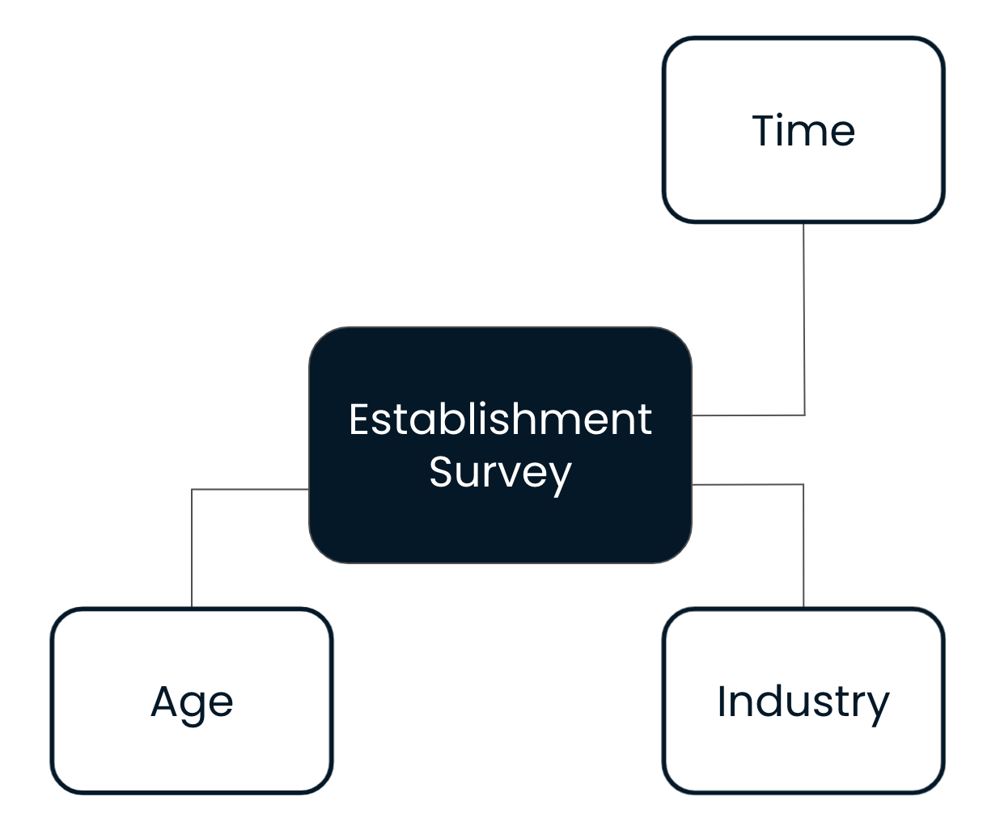
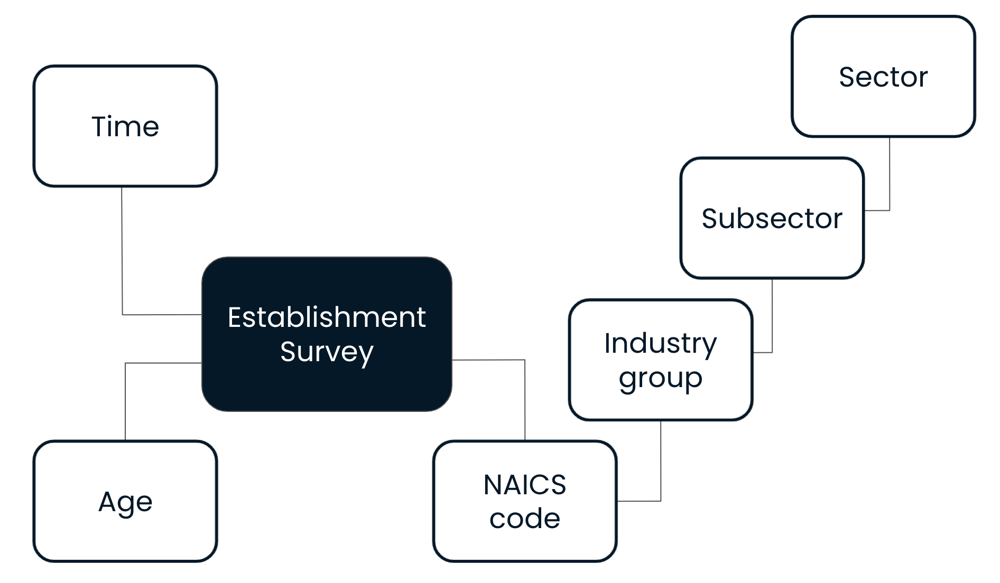

# Dimensional Modeling

1. Dimensional modeling
   Earlier, you learned that data models provide a conceptual representation of data elements and the relationships between them. There are many approaches to data modeling. We'll focus on one, the dimensional model.

2. The Kimball Model
   The Kimball model, otherwise known as the dimensional model, is one of the most popular approaches to data modeling.

3. The Kimball Model
   There are two key concepts in the Kimball model: facts and dimensions. Facts are the metrics from your business process. Dimensions provide the context surrounding a business process. These combine to form a star schema. The star schema's name comes from the way that facts and dimensions connect. We typically have several dimensions surrounding each fact. In this example, measures related to Property Sales are stored in the fact table, and the Lender, Salesperson, Date, Property, and Payment Type tables provide more context about each property sale. Huge amounts of data are organized in this way in data warehouses. Power BI is optimized to use star schemas over any other way of loading data, so Power BI is faster and easier to use with a dimensional approach.

4. Fact tables
   Let's take a closer look at fact tables first. A fact table typically has two types of columns; facts and keys. Facts are the measures or metrics from your business process. Examples include sales, employee count, or number of website visits. They are generally dates and numbers which we can aggregate in some way. Keys are how we establish relationships between fact tables and dimension tables. We expect fact tables to be tall and narrow. They have lots of rows, so we try to minimize the number of columns and how big those columns are.

5. Fact tables: an example
   Here is an example of a fact table, Property Sales. Each row represents a property that was rented at a specific date.

6. Fact tables: an example
   The first five columns contain keys or IDs that are used to link to each of the dimension tables. You'll find more information about the lender, date, property, payment type, and salesperson there.

7. Fact tables: an example
   The last two columns hold the measures. Here we're tracking the rent, in dollars, and the duration of the rental agreement, in months.

8. Dimension tables
   Next, we'll look at dimension tables which provide the context around facts. A fact may tell you how much or how often, but dimensions give the rest of the story. Who did it, how they did it, where they did it, and so on. Dimensions are shared business concepts, usually in the form of a noun such as Person, Employee, Customer, and Vendor. Dimensions contain static or slowly-changing data. Think of information like names, dates of birth, and height. Dimension tables are typically short and wide. They don't contain that many rows, but do contain a large amount of context for the facts.

9. Dimension tables: an example
   Let's take a look at an example. Here you can see the Salesperson table.

10. Dimension tables: an example
    The first column contains the same key as in the fact table and can be used to combine the information from both tables.

11. Dimension tables: an example
    The table also stores additional attributes about each salesperson in the company.

12. Star schema
    Here's that same star schema from before. In the Kimball model, dimensions are often used in multiple facts. These dimensions surrounding Property Sales could provide context to a different fact table as well. In a star schema, dimensions do not link to other dimensions.

13. The dataset
    This chapter will continue with the Census data about establishments active in the manufacturing sector. In the exercises, you will be creating a fact table that contains measures like number of employees, number of firms, and so on. Additionally, there will be more information about the establishment in the form of dimension tables. These include data on the industry, time, age, and geography of the establishments.

14. Let's practice!
    Let's check your understanding of dimensional modeling!

1. Modelado dimensional
   ¡Bienvenido de nuevo! Soy Sara y seré tu instructora en el próximo capítulo. Anteriormente, aprendió que los modelos de datos proporcionan una representación conceptual de los elementos de datos y las relaciones entre ellos. Existen muchos enfoques para el modelado de datos. Nos centraremos en uno, el modelo dimensional.

2. El modelo de Kimball
   El modelo de Kimball, también conocido como modelo dimensional, es uno de los enfoques más populares para el modelado de datos.

3. El modelo de Kimball
   Hay dos conceptos clave en el modelo de Kimball: hechos y dimensiones. Los hechos son las métricas de su proceso empresarial. Las dimensiones proporcionan el contexto que rodea un proceso empresarial. Estos se combinan para formar un esquema en estrella. El nombre del esquema en estrella proviene de la forma en que se conectan los hechos y las dimensiones. Por lo general, tenemos varias dimensiones que rodean cada hecho. En este ejemplo, las medidas relacionadas con las ventas de propiedades se almacenan en la tabla de hechos, y las tablas de prestamista, vendedor, fecha, propiedad y tipo de pago proporcionan más contexto sobre cada venta de propiedad. De esta forma se organizan enormes cantidades de datos en almacenes de datos. Power BI está optimizado para usar esquemas en estrella sobre cualquier otra forma de cargar datos, por lo que Power BI es más rápido y fácil de usar con un enfoque dimensional.

4. Tablas de hechos
   Primero echemos un vistazo más de cerca a las tablas de hechos. Una tabla de hechos suele tener dos tipos de columnas; hechos y claves. Los hechos son las medidas o métricas de su proceso empresarial. Los ejemplos incluyen ventas, recuento de empleados o número de visitas al sitio web. Generalmente son fechas y números que podemos agregar de alguna manera. Las claves son cómo establecemos las relaciones entre las tablas de hechos y las tablas de dimensiones. Esperamos que las tablas de hechos sean altas y estrechas. Tienen muchas filas, por lo que intentamos minimizar el número de columnas y el tamaño de esas columnas.

5. Tablas de hechos: un ejemplo
   A continuación, se muestra un ejemplo de una tabla de hechos, Ventas de propiedades. Cada fila representa una propiedad que se alquiló en una fecha específica.

6. Tablas de hechos: un ejemplo
   Las primeras cinco columnas contienen claves o ID que se utilizan para vincular a cada una de las tablas de dimensiones. Allí encontrará más información sobre el prestamista, la fecha, la propiedad, el tipo de pago y el vendedor.

7. Tablas de hechos: un ejemplo
   Las dos últimas columnas contienen las medidas. Aquí estamos rastreando el alquiler, en dólares, y la duración del contrato de alquiler, en meses.

8. Tablas de dimensiones
   A continuación, veremos las tablas de dimensiones que proporcionan el contexto en torno a los hechos. Un hecho puede decirle cuánto o con qué frecuencia, pero las dimensiones dan el resto de la historia. Quién lo hizo, cómo lo hicieron, dónde lo hicieron, etc. Las dimensiones son conceptos comerciales compartidos, generalmente en forma de sustantivo como Persona, Empleado, Cliente y Proveedor. Las dimensiones contienen datos estáticos o que cambian lentamente. Piense en información como nombres, fechas de nacimiento y altura. Las tablas de dimensiones suelen ser cortas y anchas. No contienen tantas filas, pero contienen una gran cantidad de contexto para los hechos.

9. Tablas de dimensiones: un ejemplo
   Echemos un vistazo a un ejemplo. Aquí puede ver la tabla de vendedores.

10. Tablas de dimensiones: un ejemplo
    La primera columna contiene la misma clave que en la tabla de hechos y se puede usar para combinar la información de ambas tablas.

11. Tablas de dimensiones: un ejemplo
    La tabla también almacena atributos adicionales sobre cada vendedor de la empresa.

12. Esquema de estrella
    Aquí está el mismo esquema de estrella de antes. En el modelo de Kimball, las dimensiones se utilizan a menudo en múltiples hechos. Estas dimensiones que rodean las ventas de propiedades también podrían proporcionar contexto a una tabla de hechos diferente. En un esquema de estrella, las dimensiones no se vinculan a otras dimensiones.

13. El conjunto de datos
    Este capítulo continuará con los datos del Censo sobre establecimientos activos en el sector manufacturero. En los ejercicios, creará una tabla de hechos que contiene medidas como el número de empleados, el número de empresas, etc. Además, habrá más información sobre el establecimiento en forma de tablas de dimensiones. Estos incluyen datos sobre la industria, el tiempo, la edad y la geografía de los establecimientos.
## Exercise 01

- Fact
  - `Quantity Ordered` (whole number)
  - `Order Amount` (decimal number)
  - `Order Date` (date)
- Dimension
  - `Item Description` (string)
  - `Shipping ZIP Code` (string)
  - `Customer Date of Birth` (date)
  - `Customer Joined Date` (date)

## Lesson02. Star Schema. Instructor

### Transcript

Got It!

1. Creating a star schema
   Hey there, welcome back. Let’s take a look at how we can actually implement a simple star schema in Power BI! In this demo, we’ll take a data file and break it out into a fact and a dimension table. We’ll also load a separate file as a new dimension. The first thing we’ll do is go to the data menu and then select text/CSV to load a CSV file. I'm going to choose the Establishment Survey dataset. I will select Transform Data to open Power Query. Let’s take a look at the data first before making any changes. As you can see, we have data about the geography of the establishments, both at the country and at the state level. It seems like we also have some information about the establishment size. However, this is just the id, we don’t know what the actual meaning of those values are yet. Lastly, we know the year the data was gathered, and the number of establishments is the measure that will go in our fact table. Let’s split this file into a fact table and a geography dimension. I’ll start by duplicating the query. This new query will form our dimension table. I’m going to rename it to Geography. We only want to keep the columns that provide more information about the geography. So I’ll keep Country id, Country, State id, and State. I’ll select them by holding the shift key and then I can keep only these columns by right-clicking and selecting Remove Other Columns. Now I want to reduce duplicates, to ensure we store the data in the most efficient way. To do that, I’ll right click again and click Remove Duplicates. Now every row in the Geography table is unique. Let’s go back to the fact table. Since the geography information is stored in our new dimension, it’s not necessary to keep it here as well. Except for the id. This is because we’ll need to be able to connect the dimension to the fact. So we’ll keep the State id as a key in the fact table and remove the rest. There we go. Our fact table is done. I’ll close and apply the changes made. In the data view, we can see both tables now. The last thing I’m going to do is add a Size dimension. As you can see we have a size id in the fact table, but we don’t know what the ids stand for. Let’s fix that by loading another file. I’ll click Get data and select the Establishment Size dataset. As you can see, this file contains the actual meaning of the size id, which is exactly what we need. I’ll go to Power Query again and I’m going to rename the table to Size. As you can see there are a lot of duplicate values, so let’s remove those. That looks better. Let’s close and apply and go take a look at the data model. To get a better view of the data model, you can collapse the Properties and Fields panes on the right. There is also a slider to zoom in and out of the Data View on the bottom right of Power BI. Here we can see the fact table and the two dimensions. The only thing left to do is to make sure there is a relationship between the fact table and the Size dimension. Size is connected to Establishment Survey by the Size Id. That’s it! Using this star schema, we can start creating reports to get insights about the establishments, sliced by geography and establishment size. Your turn!

2. Let's practice!

3. The first thing we’ll do is go to the data menu and then select text/CSV to load a CSV file. I'm going to choose the Establishment Survey dataset.
4. Transform Data to Open Power Query
5. we have data about the geography of the establishments, both at the country and at the state level
6. It seems like we also have some information about the establishment size. However, this is just the id, we don’t know what the actual meaning of those values are yet.
7. we know the year the data was gathered, and the number of establishments is the measure that will go in our fact table
8. Let’s split this file into a fact table and a geography dimension.
9. I’ll start by duplicating the query.
10. This new query will form our dimension table.
11. I’m going to rename it to Geography
12. I’ll keep Country id, Country, State id, and State.
13. Now I want to reduce duplicates, to ensure we store the data in the most efficient way
14. Let’s go back to the fact table. Since the geography information is stored in our new dimension it’s not necessary to keep it here as well. Except for the id.
15. . So we’ll keep the State id as a key in the fact table and remove the rest. There we go. Our fact table is done. I’ll close and apply the changes made.
16. The last thing I’m going to do is add a Size dimension. As you can see we have a size id in the fact table, but we don’t know what the ids stand for. Let’s fix that by loading another file.
17. Get data and select the Establishment Size dataset
18. I’ll go to Power Query again and I’m going to rename the table to Size.

### Exercise 02-01

**Splitting data into facts and dimensions**

Datasets will frequently come in a "wide" format, containing both fact and dimensional data. Breaking these files out into facts and dimensions will improve queries and can improve performance on larger datasets. In the next few exercises, we'll be creating the following star schema:

1. Load the file `Establishment Survey.csv`
2. Duplicate the Business "Establishment Survey" query and rename it to "Industry".
3. Keep only the following columns in the "Industry" table: `NAICS code`, `NAICS Code Description`, `Industry group code`, `Industry group`, `Subsector Code`, `Subsector`, `Sector Code`, and, `Sector`. Remove duplicate values from the dataset.
4. Return to the "Establishment Survey" query and remove the columns you just added to "Industry": `NAICS Code Description`, `Industry group code`, `Industry group`, `Subsector Code`, `Subsector`, `Sector Code`, and, `Sector`. Make sure to keep `NAICS code` ! This column is the key we'll use to connect the dimension to the fact table. Exit _Power Query_
5. Go to the _Model_ view to verify that there is a relationship between "Industry" and "Establishment Survey". _If for some reason a new table is not showing up in the Model view, you can manually add a relationship using the Manage relationships icon in the Home menu. Click "New…" and select the tables and columns where you want to define the relationship._
6. Go to the _Report_ view and create a new clustered bar chart visual with the `Subsector` column from the dimension table as the Axis and **Average** `Number of employees` from the fact table as the _Values_.
7. **Which subsector counted the highest average number of employees?** Food Manufacturing

Los conjuntos de datos vendrán con frecuencia en un formato "amplio", que contiene datos tanto de hechos como dimensionales. La división de estos archivos en hechos y dimensiones mejorará las consultas y puede mejorar el rendimiento en conjuntos de datos más grandes. En los próximos ejercicios, crearemos el siguiente esquema en estrella:

1. Cargue el archivo `Establishment Survey.csv`
2. Duplique la consulta "Encuesta de establecimientos" de empresas y cámbiele el nombre a "Industria".
3. Mantenga solo las siguientes columnas en la tabla "Industria": `Código NAICS`,` Descripción del código NAICS`, `Código del grupo industrial`,` Grupo industrial`, `Código del subsector`,` Subsector`, `Código del sector`, y "Sector". Elimina los valores duplicados del conjunto de datos.
4. Vuelva a la consulta "Encuesta de establecimientos" y elimine las columnas que acaba de agregar a "Industria": `Descripción del código NAICS`,` Código de grupo de la industria`, `Grupo de la industria`,` Código de subsector`, `Subsector`,` Sector Code` y, `Sector`. ¡Asegúrese de mantener el `código NAICS`! Esta columna es la clave que usaremos para conectar la dimensión a la tabla de hechos. Salir de _Power Query_
5. Vaya a la vista _Modelo_ para verificar que existe una relación entre "Industria" y "Encuesta de establecimientos". _Si por alguna razón no aparece una nueva tabla en la vista Modelo, puede agregar manualmente una relación usando el icono Administrar relaciones en el menú Inicio. Haga clic en "Nuevo ..." y seleccione las tablas y columnas donde desea definir la relación ._
6. Vaya a la vista _Informe_ y cree un nuevo gráfico de barras agrupadas con la columna `Subsector` de la tabla de dimensiones como Eje y ** Promedio **` Número de empleados` de la tabla de hechos como _Valores_.
7. ** ¿Qué subsector contó con el mayor número promedio de empleados? ** Fabricación de alimentos

### Exercise 02-02

**Load a new dimension**

Sometimes, you'll want to import a separate file as a dimension. This will further extend the amount of relevant information you can learn given your fact data. In our case, it would be nice to have some more time-related information. Adding a **Time** dimension will allow us to aggregate data not just at the year-level, but also the decade- or even century-level. Let's continue with the star schema from before:

1. Import the file named `Time.txt` from the `dataset02` folder in the `datasets` directory.
2. Go to the _Model_ view and verify that there is a relationship between the "Time" dimension and the fact table defined by the `Year` column.
3. Return to the _Report_ view and add a new slicer visual, slicing on `Decade` from the Time dimension.
4. Change the slicer to be a list of values rather than a range.
5. **How many employees did the Food Manufacturing subsector count on average during the 90s?** 3164002.59

### Exercise 02-03

**Create another dimension**
Time to add the final dimension, **Age** . In the data you can see that we have information about the `Age code` for each establishment, but we don't know what the actual meaning of those values is. Let's load another file as a new dimension to allow for slicing by establishment age.

1. Import the file named `EstablishmentAge.csv` from the `dataset02` folder in the datasets directory.
2. Go to Power Query and name the table "Age".
3. Remove duplicate values from the dataset and then close Power Query.
4. Navigate to the _Model_ view and connect the Age dimension to the Establishment Survey fact by `Age code` if this is not the case yet. _If for some reason a new table is not showing up in the Model view, you can manually add a relationship using the Manage relationships icon in the Home menu. Click "New…" and select the tables and columns where you want to define the relationship._
5. Return to the _Report_ view and add a slicer on `Establishment Age` from the new Age dimension.
6. **How many average employees did 3-year old firms in the Food Manufacturing subsector have during the 90s?** 306375.50

## Lesson03. Star and snowflake schemas. Instructor

Esquemas de estrellas y copos de nieve
   ¡Bienvenido de nuevo! Continuemos construyendo sobre su conocimiento de antes. En este video, veremos los esquemas de copos de nieve, una extensión del esquema de estrella.

2. Esquema de estrella
   Recuerde de antes que un esquema en estrella consta de una o más tablas de hechos rodeadas por tablas de dimensiones.

3. Esquema de copo de nieve
   El esquema de copo de nieve es como un esquema de estrella, excepto que permite relaciones entre dimensiones. En el ejemplo, puede ver que las dimensiones Prestamista y Propiedad están vinculadas a otras tablas de dimensiones. Tenga en cuenta que las tablas de hechos siguen siendo las mismas.

4. Una mirada más de cerca
   La mayor diferencia entre los dos estilos es cómo manejan los datos jerárquicos. Las dimensiones de estrella tienden a tener todos los niveles de una jerarquía en la misma tabla, mientras que con las dimensiones de copo de nieve, los niveles de jerarquía se dividen explícitamente en varias tablas. Aquí puede ver una tabla de dimensiones del producto. Imagina que cada producto tiene un nombre. Cada producto también pertenece a una subcategoría de productos, que a su vez pertenece a una categoría de productos. En un esquema en estrella, todos los niveles de la jerarquía, así como sus atributos, aparecen en la misma dimensión de producto. Con un esquema de copo de nieve, cada nivel de la jerarquía se convierte en su propia tabla y unimos esas tablas, generalmente con claves.

5. Comparación
   Cuando se trata de la teoría del modelado dimensional, preferimos los esquemas de estrella a los esquemas de copo de nieve. La razón clave es que los esquemas en estrella son más fáciles de entender para los usuarios empresariales. No quieren preocuparse por claves o jerarquías. El otro beneficio es que se han optimizado bastantes herramientas de inteligencia empresarial para los esquemas estrella. Aunque la teoría del modelado dimensional se inclina mucho hacia los esquemas en estrella, vemos esquemas de copos de nieve en algunos almacenes de datos. La razón de esto es que los esquemas en estrella duplican una gran cantidad de datos, lo que genera costos de almacenamiento y puede afectar el rendimiento. Además, los esquemas en estrella no son ideales para datos que se actualizan con frecuencia, especialmente con grandes dimensiones. Suponga que tiene millones de filas en una dimensión que contiene una columna para el país. Cuando cambia el nombre de un país, es posible que deba actualizar una gran cantidad de filas con el nuevo nombre del país. Por el contrario, con un esquema de copo de nieve, esto sería una actualización de una sola fila.

6. Estrellas y copos de nieve en Power BI
   Cuando se trata de Power BI en particular, es importante tener en cuenta que ambos esquemas funcionan. Si tiene un esquema de copo de nieve en un almacén existente, puede importar los datos tal cual, facilitando las migraciones. Dicho esto, Power BI prefiere los esquemas en estrella por la misma razón que la teoría del modelado dimensional. Porque es más fácil de entender para los usuarios. Además, hay algunas optimizaciones en Power BI que hacen que el rendimiento sea una preocupación mucho menor.

7. El analizador de rendimiento
   Power BI tiene un analizador de rendimiento integrado. Cuando está habilitado, realiza un seguimiento de al menos tres medidas clave en cada objeto visual. El primero es cuánto tiempo tomó leer los datos de su base de datos interna y luego realizar cualquier operación de DAX en los datos. El segundo componente es averiguar cuánto tiempo tardó el visual en renderizarse. Finalmente, una tercera medida captura todo lo demás, que normalmente es el tiempo de espera en otras operaciones, incluida la espera de que se completen las operaciones de filtrado cruzado.

8. Consejos de ajuste del rendimiento
   Hay varias formas de mejorar el rendimiento. Si la consulta de DAX tarda mucho en completarse, puede ajustar sus operaciones de DAX o mejorar el rendimiento de la carga de datos. ¡Esto podría incluir mejorar su modelo de datos! Si el gran problema está en la visualización, use imágenes menos complicadas y muestre menos información en la pantalla. Power BI necesita representar cada punto de datos, por lo que trazar decenas de miles de puntos puede llevar un tiempo. Si el valor Otro es la causa de su lentitud, es posible que desee reducir la cantidad de imágenes en la página.

9. ¡Practiquemos!
   

### Exercise 03-01
Which of the following would you expect to see on a snowflake schema but not a star schema?

1.  A fact table joining to another fact table
2. A fact table joining to a dimension table
3. A dimension table joining to another dimension table *
4. A dimension table joining to two separate fact tables

## Lesson04. Evaluating performance. Instructor
1. Evaluación del desempeño
En esta demostración, veremos cómo crear un esquema de copo de nieve y aprenderemos a usar el analizador de rendimiento. Aquí, en la vista del modelo, puede ver el esquema en estrella que creé anteriormente. Si echamos un vistazo más de cerca a la dimensión Geografía, podemos ver que está formada por datos jerárquicos. Primero el país, luego el estado. Una de las principales diferencias entre los esquemas de estrella y copo de nieve es cómo manejan los datos jerárquicos. Dado que en el esquema del copo de nieve las dimensiones se pueden conectar a otras dimensiones, podemos dividir la información del estado y del país. ¡Hagamos exactamente eso! Entraré en Power Query haciendo clic en Transformar datos. Duplicaré la tabla de geografía dos veces y cambiaré el nombre de las nuevas tablas País y Estado. Pensemos en cómo queremos conectarnos a la tabla de hechos. El nivel más detallado de geografía es Estado, y ese es también el id que está presente en la tabla de hechos. Por lo tanto, conectaremos la tabla de estado con la Encuesta de establecimientos. También necesitaremos conectar la tabla de estado a la tabla de país, lo que significa que también debemos mantener la identificación del país. Pero el valor real del país se puede eliminar aquí. Haré clic con el botón derecho y seleccionaré Eliminar. A continuación, veremos la tabla País. Este debe contener solo información del país, por lo que eliminaré todos los datos estatales. Eliminemos también las filas duplicadas. Parece que solo hay un país en nuestros datos en este momento. Tenga en cuenta que si el valor del país tuviera que actualizarse, solo tenemos que hacerlo en un lugar en este esquema de copo de nieve, mientras que sería mucho más engorroso hacerlo en el esquema en estrella de antes. Cerremos, apliquemos y echemos un vistazo al modelo de datos. Tenga en cuenta que también he mantenido la dimensión de estrella de Geografía, por lo que podemos comparar fácilmente el rendimiento más adelante. En una situación de la vida real, usaría solo uno de los dos enfoques. Puede ver que Power BI ha creado automáticamente relaciones entre la dimensión de estrella y las dimensiones de copo de nieve. Esto no está bien. Eliminémoslos. Haré clic derecho en la línea y seleccionaré Eliminar. Hagamos lo mismo con la otra mesa. ¡Aquí vamos! Así que estas son nuestras dimensiones de copo de nieve. Ahora voy a crear una relación entre las tablas de hechos y de estado. Podría arrastrar los nombres de las columnas uno encima del otro o usar el botón Administrar relaciones aquí. Seleccionaré Nuevo y elegiré las dos tablas. Puede ver que Power BI ha reconocido el Id. De estado como la clave, lo cual es correcto. Haga clic en Aceptar y cierre. Por último, puede ver que la relación entre el estado y el país es una línea de puntos, lo que significa que está inactivo. Cambiemos eso rápidamente yendo a Propiedades. Aquí vamos. Ese es nuestro esquema de copo de nieve. Y este sería nuestro esquema estrella. Iré a la vista Informe y crearé dos visualizaciones. Primero, crearé un gráfico de barras con el número de establecimientos por estado, utilizando el campo de la dimensión de estrella. Luego, haré lo mismo pero usaré la dimensión del copo de nieve para el estado. Cambiemos rápidamente el nombre de estos elementos visuales a esquema de estrella y esquema de copo de nieve. Ahora, podemos comparar el desempeño. Iré a Ver aquí en la parte superior y haré clic en Analizador de rendimiento. Aparece el panel del analizador de rendimiento. Comenzaré a grabar y luego actualizaré las imágenes. Esto me mostrará el tiempo que lleva cargar las dos imágenes en la página en milisegundos. Si actualizo un par de veces, podemos ver que un esquema no es consistentemente más rápido que el otro. Con nuestro pequeño conjunto de datos, todo se carga bastante rápido, pero si trabaja con miles o millones de filas, el esquema en estrella debería ser más eficiente. Esto se debe a que los esquemas en estrella solo unirán la tabla de hechos con las tablas de dimensiones, lo que conducirá a tiempos de ejecución más rápidos. ¡Eso es todo, es hora de hacer algunos ejercicios!

1. Evaluating performance
   In this demo, we’ll see how to create a snowflake schema and learn how to use the performance analyzer. Here in the model view, you can see the star schema I created earlier. If we take a closer look at the Geography dimension, we can see that it is made up of hierarchical data. Country first, then State. One of the main differences between star and snowflake schemas is how they handle hierarchical data. Since in the snowflake schema dimensions can be connected to other dimensions, we can split out the state and country information. Let’s do exactly that! I’ll go into Power Query by clicking Transform data. I’ll duplicate the geography table twice and rename the new tables Country and State. Let’s think about how we want to connect to the fact table. The most detailed level of geography is State, and that is also the id that is present in the fact table. So we’ll connect the State table to Establishment Survey. We’ll also need to connect the State table to the Country table, which means we need to keep the Country id as well. But the actual country value can be removed here. I’ll right-click and select Remove. Next, we’ll look at the Country table. This one should contain only country information, so I’ll remove all state data. Let’s also remove the duplicate rows. Looks like there is only one country in our data at the moment. Note that if the country value would have to be updated, we only have to do it in one place in this snowflake schema, whereas it would be a lot more cumbersome to do this in the star schema from before. Let’s close and apply and take a look at the data model. Note that I’ve kept the Geography star dimension as well, so we can easily compare performance later on. In a real-life situation, you would use only one of the two approaches. You can see that Power BI has automatically created relationships between the star dimension and the snowflake dimensions. This is not right. Let’s remove them. I’ll right click on the line and select Delete. Let’s do the same for the other table. There we go! So these are our snowflake dimensions. Now I’m going to create a relationship between the fact and State tables. I could drag the column names on top of eachother or use the Manage relationships button here. I’ll select New and choose the two tables. You can see that Power BI has recognized State id as the key, which is correct. Click OK and close. Lastly, you can see that the relationship between State and Country is a dotted line, which means it’s inactive. Let’s quickly change that by going into Properties. There we go. That’s our snowflake schema. And this would be our star schema. I’m going to go into the Report view and create two visualizations. First, I’ll create a bar chart with the number of establishments by state, using the field from the star dimension. Then, I’ll do the same but use the snowflake dimension for the state. Let’s quickly rename these visuals to star schema and snowflake schema. Now, we can compare the performance. I’ll go to View here at the top and click on Performance analyzer. This pops out the Performance analyzer pane. I’ll start recording and then refresh the visuals. This will show me the time it takes to load the two visuals on the page in milliseconds. If I refresh a couple of times, we can see that one schema isn’t consistently faster than the other. With our small dataset everything loads pretty quickly, but if you’re working with thousands or millions of rows, the star schema should be more efficient. This is because star schemas will only join the fact table with the dimension tables, leading to faster execution times. That’s it, time for some exercises!

2. Let's practice!

### Exercise 04-01
**Star schemas**
Loading and querying across star schemas is at the core of Power BI. Let's continue with our star schema from before. In this exercise, we'll take a closer look at the way the **Industry**  dimension is modeled.

1. Create a new page and name it "Industry insights". Navigate to the _Data_  view to get familiar with the columns in the "Industry" dimension.
2. Navigate to the _Data_  view to get familiar with the columns in the "Industry" dimension.
3. Go back to the _Report_  view and add a table visualization  with the following columns from the "Industry" dimension: `Industry group`, `NAICS Code description`, `Sector`, and `Subsector`.
4. Note that the columns in the Industry table make up a hierarchy. Starting from the highest level, each category gives a more granular view of what industry the establishments operate in.
5. Put the columns in the right order, going from less to more detail.
6. **How is the Industry hierarchy structured?**
   - Industry group > NAICS Code description > Sector > Subsector
   - Sector > Subsector > Industry group > NAICS Code description * 
   - Sector > Subsector > NAICS Code description >  Industry group
### Exercise 04-02

**Snowflake schemas**

While Power BI is optimized for star schemas, it needs to work in a variety of use cases. One alternative data modeling approach is to use snowflake schemas, where dimensions can be connected to other dimensions. 

A big difference between the two is how they handle hierarchical data. _Star_  dimensions tend to have all levels of a hierarchy in the same table. With _snowflake_  dimensions, hierarchy levels are broken out into multiple tables.

Let's create a _snowflake schema_  and break down the **Industry**  dimension as follows.

Note that, in this exercise, we'll also keep the star dimension so that we can compare the results. In real life, you would choose one of the two approaches.

1. Go to Power Query and duplicate the Industry queries four times. Rename the duplicated queries to "NAICS code", "Industry group", "Subsector", and "Sector".
2. Remember the hierarchy order: `Sector` > `Subsector` > `Industry group` > `NAICS Code description`. For each table, keep only the code and text description columns of that level of the hierarchy, as well as the code of the previous, less granular, level in the hierarchy (if there is one). Make sure to remove duplicate values.
3. 
   - Close Power Query and go to the _Model_  view.
   - Delete the automatically created relationships between the "Industry" star dimension and the four tables you just created.
4. 
   - Create a relationship between "NAICS code" and the fact table, "Establishment Survey". 
   - You can zoom in and out on the data model by using the `+`  and `-`  in the bottom right corner of the Power BI window.
5. Check that the other snowflake dimensions are connected to each other in the right order. If there are dotted-line relationships, double-click on the relationship to go into the _Properties_  and select "Make this relationship active."
6. **In the snowflake schema, how many rows would you have to update if the name of the "Food Manufacturing" subsector changes?** 1
### Exercise 04-03

**The performance analyzer**

You've modeled the industry data in two different ways; a star schema and a snowflake schema. Let's compare the performance between the two approaches.

Power BI's _performance analyzer_  provides a mechanism for measuring performance in Power BI. It looks at the speed of data retrieval, DAX operations, and displays of information on the screen. Although the visuals and datasets we will work with are fairly simple and will load quickly, we can still use this value to understand the tool's potential.

1. Go to the _Report_  view and create a new page named "Comparison". Create a line chart with the decade on the x-axis, the **average**  number of employees on the y-axis, and the subsector (from the  _star_  dimension "Industry") on the legend.
2. Create another line chart with the decade on the x-axis, the **average**  number of employees on the y-axis, and the subsector (from the _snowflake_  dimension "Subsector") on the legend.
3. Change the title of the first line chart to "Star schema". Change the title of the second line chart to "Snowflake schema".
4. Open the _Performance analyzer_  and start recording to begin performance analysis. Refresh all visuals on the page. Do this several times to see if there is a consensus on whether the star or snowflake schema is faster in this case.
5. Looks like there isn't a big difference in speed between both approaches for our relatively small dataset. Dig a level deeper and go take a look at what the drivers of performance are for each visual.
6. **What takes the most amount of time for both visuals?**
   - DAX query
   - Visual display
   - Other