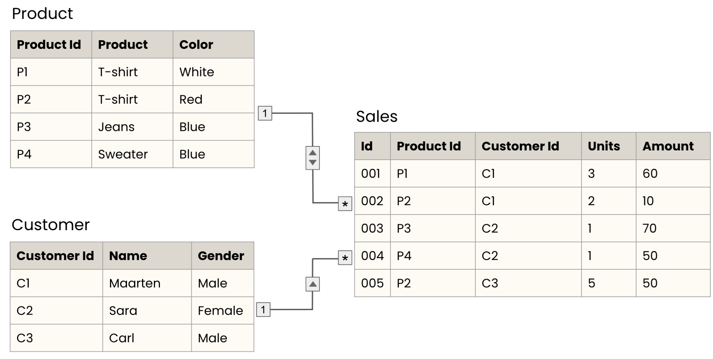
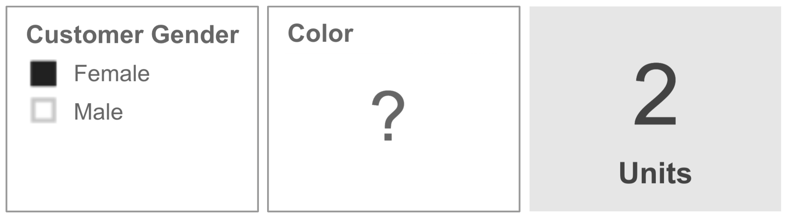

# Advanced Data Modeling

## Working with relationships.

### Exercise 01-01. 
**Bi-directional relationships**
In most situations, using single direction cross filtering on your relationships is enough. There are, however, some cases where bi-directional filters are necessary. One example is showing only relevant slicer options to end users. Consider the following data model. The model diagram has been modified to reveal the table rows.

What would the Color slicer display when "Female" is selected in the Customer slicer?

<h4>Possible Answers</h4>

- White, Red, Blue
- White, Red
- Blue * 

## Cross-filtering and role-playing dimensions

1. **Cross-filtering and role-playing dimensions**.
Let's cover bi-directional cross filtering and role-playing dimensions in Power BI. By definition, bi-directional cross filtering, in contrast to single cross filtering, allows you to filter on both sides of the table relationship. Let's illustrate with an example. In our fact table, the data ranges from 1978 to 2018. Suppose we have a part of a report that has slicers for both Year and Establishment Age. Since the fact table doesn't contain data of the years 2019 and later, the end user shouldn't be allowed to see establishment ages when filtering for the year 2019 and onwards. In the model view, you can see that there is no filter that goes from this fact table towards the Age dimension. To change this single directional relationship to bi-directional, double click the relationship arrow and set the cross filter direction to both. You can see that the arrows are now pointing in both directions of the table relationship. If we now go back to the report view, bi-directional cross filtering has filtered out the possibility to select an establishment age for the non-existing years in the fact table. They appear again when I select an earlier year. This allows you to have more control over how end users can apply filters when working with related tables. Let's go back to our fact table. As you can see there is another Year value present in the data. The Year column represents the year the survey was conducted in, but the Year Founded date refers to the year each establishment was founded. In the data model we can see that there's only one relationship between Time and Establishment Survey, on Year. But what if we wanted to know the average number of employees for establishments founded in the 90s, so by decade? We can't answer that question at the moment. The first thing I'll do to fix that, is create a new relationship between Year Founded and Year. As you can see, the relationship line is dotted, indicating that the relationship is inactive. This is because Power BI doesn't allow for multiple active relationships between tables. But no worries, we can still tell Power BI to use this relationship. Let's go into the Report view. I'm going to create a new measure in the fact table, and call it Number of employees by Year Founded. I'll start by using the CALCULATE() function. For the first argument, I'll take the average of the Number of employees from the fact table. In the second argument, I'll tell Power BI what relationship to use. With the USERELATIONSHIP() function I can specify that I want Year from the Time dimension linked to Year Founded from the fact table. If I now create a table with Decade and the measure I just created, I'm able to see the number of employees by the decade the establishment was founded in. That's all! Time to try it yourself in the exercises.

2. Let's practice!

### Exercise 02-01. 

**Bi-directional cross-filtering**

Although bi-directional filtering could come at a performance cost, and is generally frowned upon in Power BI, there are specific circumstances in which it can make sense. The most common scenario involves filtering slicers to exclude any dimensional values which do not have corresponding entries in the fact table. 

To improve your reporting skills, you'll create two slicers that are connected and will only show values that actually exist in the fact table, <code>Summary Statistics for Manufacturing</code>.

#### Instructions
1. 

Open <code>4_1_filtering_direction.pbix</code>.

2. 

In the <em>Report</em> view, create two <em>Slicer</em> visuals:

<ul>
<li><code>Industry group</code> from the <code>NAICS Code</code> dimension</li>
<li><code>Geographic Area Name</code> from the <code>Geography</code> dimension
Change both to a list.</li>
</ul>

3. 

Add a <em>Card</em> visual and make it display the <code>Number of employees</code> from <code>Summary Statistics for Manufacturing</code>.

4. 
<ul>
<li>Select a random state on the <code>Geographic Area Name</code> slicer. </li>
<li>The <em>Card</em> visual displays a blank because there is no data associated to this state.</li>
<li>The <code>Industry Group</code> doesn't change because the two dimension tables only filter in one direction to the fact table.</li>
</ul>

5. 

Let's fix that. Make the two relationships cross filter in both directions in the <em>Model</em> view.

6. 

Go back to the <em>Report</em> view, and note that the selected state now has removed the <code>Industry group</code> options. Deselect the state and select <code>Industry group</code> "3111".

7. **Which 'Geographic Area Name' is left when 'Industry group' "3111" is selected?**
    - United States
    - All of the states
    - Alabama

### Exercise 02-02. 
**Role-playing dimensions**

Role-playing dimensions are an important part of the Kimball dimensional model, but implementing them in Power BI is not straightforward. Instead of copying tables several times, the appropriate technique is to use the <code>USERELATIONSHIP()</code> function in DAX to specify relationships on measures.

Each year, your company determines for each NAICS code its largest industrial business customer for that sector. As such, users can compare sales, revenue or number of employees between one sector and its related sector. This data is stored in a new dataset, called <code>Summary Statistics Double NAICS</code>.
You are asked to create a report where users can quickly compare the number of employees per industry subsector.

<em>If you have lost any progress, close any open reports and load <code>4_2_role_playing.pbix</code> from the Exercises folder on the desktop.</em>

#### Instructions
1. 

In Power BI, import <code>Summary Statistics Double NAICS.txt</code> and select "Load". The dataset can be found in the Chapter 4 subfolder of the Datasets folder on the Desktop.

2. 

Navigate to the <em>Model</em> view and note that there is a relationship between <code>Summary Statistics Double NAICS</code> and <code>NAICS Code</code>, linked by <code>2017 NAICS Code</code> in both tables.

<em>If for some reason a new table is not showing up in the Model view, you can manually add a relationship using the Manage relationships icon in the Home menu. Click "New…" and select the tables and columns where you want to define the relationship.</em>

3. 

Create a second relationship between the <code>2017 NAICS Code</code> column from the <code>NAICS Code</code> dimension and the <code>NAICS Code Related</code> column from <code>Summary Statistics Double NAICS</code>. Note that the relationship will be inactive.

4. 
<ul>
<li>Return to the <em>Report</em> view and create a new measure <code>Related Number of employees</code> in the <code>Summary Statistics Double NAICS</code> table.</li>
<li>Use the <code>CALCULATE()</code> function, to sum the <code>'Summary Statistics Double NAICS'[Number of employees]</code> using the relationship between <code>'NAICS Code'[2017 NAICS Code]</code> and <code>'Summary Statistics Double NAICS'[NAICS Code Related]</code>.</li>
<li>The second argument of <code>CALCULATE()</code> should use the <code>USERELATIONSHIP()</code> function.</li>
</ul>

5. 
<ul>
<li>Create a new page and call it <code>Role Playing</code>. </li>
<li>Add a <em>Scatter chart</em> visual whose <em>Details</em> is <code>SUBSECTOR</code> from <code>NAICS Code</code>, <em>X Axis</em> is <code>Number of employees</code>, and <em>Y Axis</em> is <code>Related Number of employees</code>, both from <code>Summary Statistics Double NAICS</code>.</li>
</ul>

6. **What is the SUBSECTOR with the highest total of Related Number of employees?**

## Identifying performance problems

1. **Identifying performance problems**.
Welcome back! In this last lesson, we'll discuss ways to identify and solve performance issues.

2. **Resolving performance problems**.
Power BI has the ability to manage huge databases, and is usually pretty fast. But sometimes your end user could be waiting minutes for the visuals to load. It's important to know the good practices that help lighten the work carried out by the machine to make your reports as efficient as possible. The first step in handling user-reported slowness issues is identifying where the slowness presents.

3. **Performance problems**.
There are a few places where things can go wrong. You might see slowness when importing data or querying a database via DirectQuery. Rendering the visuals could take longer than it should. Performance can also be impacted by the use of calculated versus computed columns. Lastly, inefficient relationships can cause slow performance. There are other performance issues, but we won't focus on those in this course.

4. **Optimizing data import**.
There are multiple things you can do to optimize data import. The biggest one is to remove unnecessary rows and columns. If you have data which you know will not be used, it's best to delete it. Choosing the correct data type is also important. Storing numeric data as numbers takes up less space than storing it as strings. Additionally, having to cast the data back to numeric later on can slow down performance. Grouping and summarizing data can also improve performance when importing data because it means less data stored on disk and less work to get to aggregate results.

5. **Optimizing Direct Query**.
Throughout this course, we have used the Import model to bring in data from CSV or Excel files. When working with databases, however, there is a second model: DirectQuery. Import stores all of the data in Power BI, whereas DirectQuery allows the Power BI to query the remote data source when needed. When working with DirectQuery, the most important thing to keep in mind is that you want the database to be as fast as possible. One piece of advice is to limit the number of queries running in parallel. One of the most common data sources for Power BI is a relational database management system. When using DirectQuery there, be sure to write efficient SQL queries and use appropriate indexes. The goal is to obtain from the database exactly the data necessary to solve a problem and no more.

6. **Calculated versus computed columns**.
Calculated columns are written in DAX, whereas computed columns come from Power Query, written in the M language. Both allow you to build custom columns from data, but they can differ in terms of performance. In general, computed columns are only slightly faster than simple calculated columns. However, computed columns can be considerably faster than complicated DAX queries when working with large datasets. This is because computed columns are generated at import time, meaning that they get built a single time. By contrast, calculated columns are generated per visual at runtime.

7. **Removing bi-directional filtering using filter measures**.
Earlier, we looked at a use cases of bi-directional filtering; finding relevant slicer entries between dimensions. Power BI offers an alternative since this type of relationship can be inefficient. We can create something called filter measures to avoid bi-directional relationships.

8. **Removing bi-directional filtering using filter measures**.
Let's look at an example. We have two dimensions feeding into the summary statistics fact: Year and Geography. We want to display only the year and geography values which have appropriate values in the fact table. The filter measure, called Slicer_MyFactTable, will do that. Let's see how this works.

9. **Removing bi-directional filtering using filter measures**.
We want to return the number 1 if conditions are met such that we have data in the fact table for a given value in a slicer. To do this, we first create a simple DAX measure, which uses the ISEMPTY() function to determine if there are any values in the fact table. We want to get only cases in which the fact table is not empty for a given filter and then convert that to an integer using the INT() function. This will return 1 when we have at least one value and 0 when there are no values. From there, we can add a visual filter to any dimensional slicer and show items only when the filter measure returns 1.

10. **Displaying visuals**.
There are a few more tips which can help optimize performance for displaying visuals. First, use restrictive filters to minimize the number of data points which appear on visuals. Furthermore, limit the number of visuals which you see on a single page, as each of these visuals needs to load each time. Also, avoid slow custom visuals. Custom visual authors do the best they can to release high-quality code, but these visuals might not always be speedy.

11. **Let's practice!**.
That's it! Make sure to keep these tips in mind if you're ever faced with slow reports. Time for practice!

### Exercise 03-01. 
**Optimizing performance**

Power BI has the ability to manage huge amounts of data, but still, sometimes you can find yourself waiting minutes for the visuals to load. At that point, it's important to think about how to speed things up. There are multiple areas to optimize performance in. 

Put the optimization techniques in the right category.

- Load data with Data Import/Direct Query
    - Writing efficient SQL queries
    - Choosing the correct data types
    - Keeping only the relevant data from the dataset
- Calculated versus computed columns
    - Using computed columns instead of calculated columns for complex calculations
- Inefficient relationships
    - Using filter measures instead of bi-directional filtering
- Displaying visuals
    - Minimize the amount of data shown in visuals
    - Limiting the number of visuals on report pages

#### Instructions
## Performance tips in Power BI

1. **Performance tips in Power BI**.
Welcome back! In this final demo, we'll use the performance analyzer again, and look at how bi-directional filtering can be avoided to improve performance. Recall that you created a GEO_ID column in a previous exercise. It was done by merging three separate columns into one using Power Query. Alternatively to merging, you could create a new column, let's say 'concat', and use the CONCATENATE() function to concatenate for example NAICS code and establishment age code. Notice that CONCATENATE() only allows two arguments. To concatenate three columns or more, you'll need to use concatenate again, nested in the first CONCATENATE() call. In this example, I concatenated NAICS code, establishment age code, and geographic area name, which looks like this in a table. In the View menu, you can open the Performance analyzer. After starting the recording, refresh the visuals a couple of times to measure the duration in milliseconds it takes to create the report. You'll need this in the exercises, where you'll compare the performance of the CONCATENATE() function with merging columns in Power Query. A final action to improve performance in Power BI could be when you are working with lots of bi-directional cross filters in the data model. In the example where you had a report with a slicer for year and establishment age code, you don't want users to select a year or code that isn't present in the connected fact table. We achieved this by adding a bi-directional cross filter in the data model. However, adding more and more bi-directional cross filters comes at a performance cost. An alternative for bi-directional cross-filtering is by using DAX syntax. First, let's remove the existing bi-directional cross filters. Create a new measure, let's call it slicer_filter, which will check whether the fact table, business establishments by age, is not empty. If so, this formula returns the integer value of true which is one, and zero when it is false. You could then use this measure as a filter on the Year slicer. As a result, the Year slicer will only show values which exist in the fact table, and will in this case get rid of all the 1960s data points. Note that you can't place a measure as a filter on the whole page or all pages levels. So to apply the slicer_filter on the establishment age code slicer as well, the filter needs to be applied in the same way. Don't worry too much about the precise formula, you'll get the chance to practice this during the exercises. The end result is that this allows you to do the equivalent of cross filtering without all the performance penalties and potential data issues related to bi-directional cross filtering. Let's get to the final set of exercises and improve Power BI's performance!

### Exercise 04-01. 
**Data types and calculations**

Choosing data types in Power BI and Power Query is easy, and there are benefits to choosing the right data type up-front. Let's compare the performance difference between summing numeric data and converting string data to numeric in DAX before summing.

#### Instructions
1. 

Open the Power BI Desktop file named <code>4_3_data_types.pbix</code>, from the Exercises folder on the desktop, and go to Power Query.

2. 
<ul>
<li>Open <em>Power Query</em> and go to the "Business Establishments" table. </li>
<li>Duplicate the <code>Number of employees</code> column and rename it to <code>Number of employees (text)</code>.</li>
</ul>

3. 

Change the data type of <code>Number of employees (text)</code> to "Text" and close the <em>Power Query</em> editor.

4. 

Create a new measure in "Business Establishments" named <code>Sum Employees (text)</code> that converts the text to a numeric value and then sums those values. The DAX formula to do that is: <code>SUMX('Business Establishments', VALUE('Business Establishments'[Number of employees (text)]))</code>

5. 

Create two table visuals:

<ul>
<li>The first table visual should include <code>Rowguid</code> and <code>Number of employees</code>  from "Business Establishments". </li>
<li>The second visual should include <code>Rowguid</code> and <code>Sum Employees (text)</code> from "Business Establishments". </li>
</ul>

6. 

Open the <em>Performance analyzer</em> and refresh the visuals two or three times, focusing on the DAX query component.

7. **Which version of the "Number of employees" column is faster to process?**
    - Numeric
    - Text

### Exercise 04-02. 
**Calculated versus computed columns**

In the previous chapter you learned how to create a new, composite key, for the Geography dimension by merging three columns together in Power Query. Now, we'll also create the composite key through DAX. 

Let's compare which method leads to a better performance, <em>computed columns</em> created in Power Query or <em>calculated columns</em> created in DAX.

#### Instructions
1.
2.
3.
4.
5.
6.
7.

### Exercise 04-03. 
**An alternative to bi-directional filtering**
#### Instructions
1.
2.
3.
4.
5.
6.
7.